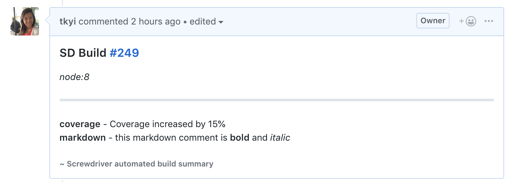

# Metadata

## Metadataとは？

Metadataは [ビルド](../../about/appendix/domain#build) に関する情報を保持する key/value ストアです。Metadataは [steps](../../about/appendix/domain#step) 内で組み込まれている [meta CLI](https://github.com/screwdriver-cd/meta-cli) を利用することで、全てのビルドで更新と取得が可能です。

## デフォルトMetadata

Screwdriver.cdはデフォルトでMetadataに以下のキーを設定しています。

| キー | 説明 |
| --- | ----------- |
| build.buildId | ビルドのID |
| build.jobId | ビルドと紐付いているジョブのID |
| build.eventId | ビルドと紐付いているイベントのID |
| build.pipelineId | ビルドと紐付いているパイプラインのID |
| build.sha | ビルドが実行しているコミットのsha |
| build.jobName | ジョブ名 |
| commit.author | `avatar`, `name`, `url`, `username`を含むAuthor情報のオブジェクト |
| commit.committer | `avatar`, `name`, `url`, `username`を含むCommitter情報のオブジェクト |
| commit.message | コミットメッセージ |
| commit.url | コミットへのURL |
| commit.changedFiles | カンマ区切りの変更ファイルリスト<br>**注意**: UIから新たにイベントを開始した場合はコミットでトリガーされたことにならないので、この値は空になります |
| sd.tag.name | タグ名 |
| sd.release.id | リリースID |
| sd.release.name | リリース名 |
| sd.release.author | リリース |

## Metadataの操作

Screwdriver は meta store から情報を取得するためのシェルコマンド `meta get` と、meta store に情報を保存するためのシェルコマンド `meta set` を提供しています。

### 同一パイプライン

Screwdriverのビルドでは、同ビルドでセットされたMetadata、もしくは同イベントの以前のビルドでセットされたMetadataを取得することができます。

例: `build1` -> `build2` -> `build3`

`build2` のMetadataは、自身でセットしたMetadataと `build1` でセットしたMetadataを保持しています。

`build3` のMetadataは、 `build2` が持っていたMetadataを保持しています。 ( `build1` のMetadataも含む)

```bash
$ meta set example.coverage 99.95
$ meta get example.coverage
99.95
$ meta get example
{"coverage":99.95}
```

例:

```bash
$ meta set foo[2].bar[1] baz
$ meta get foo
[null,null,{"bar":[null,"baz"]}]
```

サンプルリポジトリ: https://github.com/screwdriver-cd-test/workflow-metadata-example

注意:

- `foo`がセットされていない場合に`meta get foo`を実行した場合、デフォルトで`null`を返します。

### 外部パイプライン

Screwdriverのビルドは外部トリガー元のジョブのMetadataにも `--external` フラグにトリガー元のジョブを指定することでアクセスすることができます。

例: `sd@123:publish` -> `build1` の時 `build1` のビルド内で:

```
$ meta get example --external sd@123:publish
{"coverage":99.95}
```

注意:

- `meta set` は外部パイプラインのジョブに対してはできません。
- もしビルドのトリガー元のジョブが `--external` で指定した外部パイプラインのジョブではなかった場合、meta はセットされません。
- `--external`で指定したパイプラインのジョブが、そのビルドをトリガーしていなかった場合は、最後に成功した外部ジョブの`meta`が取得されます。

### APIを使用する

`/v4/events`への`POST`リクエストのpayloadに設定することでも、イベントメタを設定することができます。

APIのエンドポイントについての詳細は、[APIのドキュメント](./api)を参照してください。

[イベントメタトリガーのサンプルリポジトリ](https://github.com/screwdriver-cd-test/event-meta-trigger-example)や、それに対応した[イベントメタのサンプルリポジトリ](https://github.com/screwdriver-cd-test/event-meta-example)も参考にしてください。

### プルリクエストコメント

> 注意：この機能は現在のところGithubプラグインでのみ使用可能です

Metadataを使用することで、ScrewdriverのビルドからGitのプルリクエストにコメントを書き込むことができます。コメントの内容はパイプラインのPRビルドから、metaのsummaryオブジェクトに書き込まれます。

プルリクエストにMetadataを書き出すには、`meta.summary`に必要な情報をセットするだけです。このデータはheadlessなGitのユーザからのコメントとして出てきます。

例として、カバレッジの説明を加えたい場合には、screwdriver.yamlは以下のようになります。

```yaml
jobs:
  main:
    steps:
      - comment: meta set meta.summary.coverage "Coverage increased by 15%"
```

以下の例のようにMarkdown記法で書くこともできます。

```yaml
jobs:
  main:
    steps:
      - comment: meta set meta.summary.markdown "this markdown comment is **bold** and *italic*"
```
これらの設定をすると、以下のようにGitにコメントがされます。



### 追加のプルリクエストチェック

> 注意：この機能は現在のところGithubプラグインでのみ使用可能です

プルリクエストビルドのより詳細な状態を知るために追加のステータスチェックをプルリクエストに加えることができます。

プルリクエストに追加のチェックをするには、`meta.status.<check>`にJSON形式で必要な情報を設定するだけでできます。このデータはGitのプルリクエストのチェックとして出てきます。

設定できるフィールドは以下の通りです。

| Key | Description |
| --- | ----------- |
| status (String) | チェックのステータス。次から一つ選びます (`SUCCESS`, `FAILURE`) |
| message (String) | チェックの説明 |
| url (String) | チェックのリンクのURL（デフォルトはビルドのリンク） |

例として、`findbugs`と`coverage`の2つの追加のチェックを加える場合、screwdriver.yamlは次のようになります。

```yaml
jobs:
  main:
    steps:
      - status: |
          meta set meta.status.findbugs '{"status":"FAILURE","message":"923 issues found. Previous count: 914 issues.","url":"http://findbugs.com"}'
          meta set meta.status.coverage '{"status":"SUCCESS","message":"Coverage is above 80%."}'
```

これらの設定は以下のようにGitのチェックになります。


### カバレッジとテスト結果

metadataを利用して、Screwdriverのビルドからビルドページにカバレッジの結果やテスト結果をそれらの生成物へのURLと一緒に取り込むことができます。ScrewdriverのUIはmetadata内の`tests.coverage`、 `tests.results`、 `tests.coverageUrl`、 `tests.resultsUrl`を読み込んで対応するものを表示させたり設定したりします。

screwdriver.yamlの例:

```yaml
jobs:
  main:
    steps:
      - set-coverage-and-test-results: |
          meta set tests.coverage 100 # カバレッジパーセンテージ数
          meta set tests.results 10/10 # 成功テスト数/全テスト数
          meta set tests.coverageUrl /test/coverageReport.html # ビルド成果物への相対パスで指定します
          meta set tests.resultsUrl /test/testReport.html # ビルド成果物への相対パスで指定します
```

> 注意: metadataはSonarQubeの結果を上書きします。

これらの設定により、ビルドページは次のようになります:


### イベントラベル

metaのキーに`label`を指定するとイベントにラベルを付与することができます。このキーは[ロールバック](./FAQ.html#ビルドのロールバックを行うには？)するイベントの指定に役立ちます。

screwdriver.yamlの例:
```yaml
jobs:
  main:
    steps:
      - set-label: |
          meta set label VERSION_3.0 # 設定した値はイベントに紐づいてパイプラインページ上に表示されます
```

結果:


### 通知

metaを利用することで通知をカスタマイズすることができます。
metaのキーは通知ブラグインごとに異なります。

Slack通知をするscrewdriver.yamlの例:
```yaml
jobs:
  main:
    steps:
      - meta: |
          meta set notification.slack.message "<@yoshwata> Hello!!"
```

Result:

